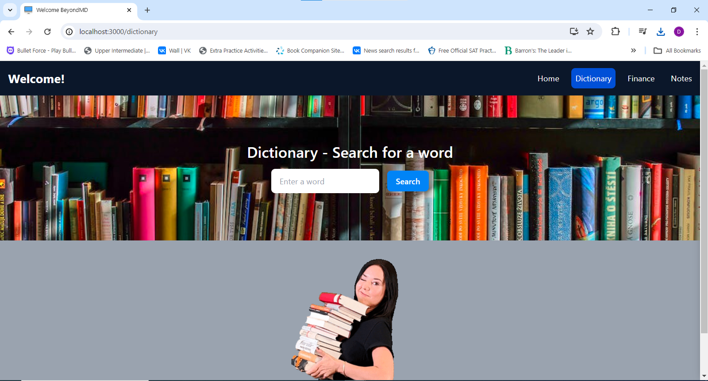

The project is divided into the backend and the frontend. The Frontend is developed with React JS whereas the Backend
is developed with Django. The website is multi-purpose service website, where you can find several services, such as a Urban
Dictionary, Finance page where you can exchange currencies and see stock information. As it is requested, the Home page includes
a text saying "Hello BeyondMD" and a button that can let you download my Resume.

After that is the services list. You can select between the dictionary, notes
and the finance page. In the Notes page you can keep notes and delete them
in real time. 

  
   
   

  
  

 

-- Technology Description -- 
The front end is built with React JS and Tailwind CSS. I used Tailwind CSS because
it seemed more practical to me in this case. The pages are contained in a 'pages'
directory and the components are contained in a 'components' directory. The assets of the 
website, such as images used for the background are stored in a directory named 'assets'.  

In the backend, the apis that can be called have their functions in the python file named
views.py. The urls are defined in the urls.py file. The database that is used in this case is
the sqlite3 database. It is a lightweight database and easy to use. Everything else is explained
by the comments in the code itself.

  
   
   

  
  

 
-- Urban Dictionary -- 
Once you go to the Urban Dictionary page you can type in a word and once you
click the search button, a request will be sent to the Django Backend. The response will
be in the form of JSON object. After retrieving the response in a JSON file, we use
the Definitions with the map function. 

  
   
   
  
  
  

 
-- Finance Page -- 
In this page you can convert between different currencies. There are two Select components
where you can find the list of currencies. After choosing two currencies, you have to enter the value
and then click the convert button. The request is made to the Django Backend. The response will be the 
result after convertion. At the bottom of the page is the list of stocks which is retrieved
from the backend. The request is made to the backend and then the backend gets the parameters, and makes a call
to the ready api.

 

-- Notes -- 
In this page you can add notes and keep notes as you want. Once you fill the note form
you can click the submit button and it will be added to the list of notes. The change will
be reflected in real time. Every note that you have added will be displayed in a list of notes.
If you want to delete a note, just click 'delete' on the corresponding note. Each note is associated
with a specific ID, once you click the 'delete' button, the ID of that note is sent to the django
backend with a DELETE http request. After that the instance is deleted from the sqlite3 database in
the django backend.

 

-- The PDF resume -- 
In the home page you can download my resume. Once the button is clicked
the request is sent to the Django Backend. The django backend has the file in 
one of the folders, and when it receives a request from the front-end, it returns
the PDF resume as a blob file.

